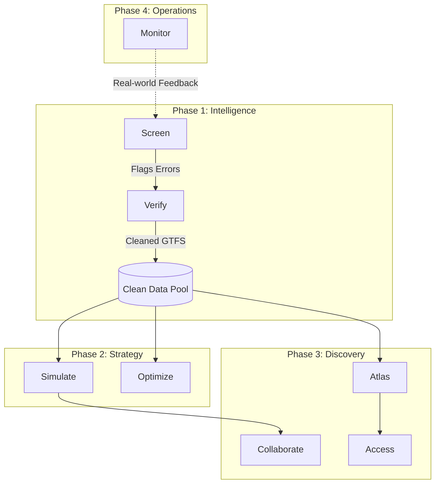

# Atlas: The Unified Transit Intelligence Ecosystem

Atlas is not just a collection of tools; it is a **closed-loop feedback system** for urban mobility. This document defines the role, justification, and relationship of every module.

---

## 🏗️ The Core Pipeline
The ecosystem is structured around three phases of the transit planning lifecycle:
1. **Intelligence (Cleaning & Integrity)**: Ensuring the data represents reality.
2. **Strategy (Modeling & Simulation)**: Testing changes in a safe environment.
3. **Discovery (Viewing & Public Engagement)**: Understanding the network and sharing it.

---

## 🛠️ Existing Tools

### 1. Screen
- **Definition**: Automated GTFS-static analysis and route tiering.
- **Justification**: Garbage in, garbage out. Planners often work with broken or messy GTFS data. Screen identifies these issues before they ruin a simulation.
- **Relationship**: Feeds **Verify** with detected anomalies.

### 2. Verify
- **Definition**: Human-in-the-loop validation interface.
- **Justification**: AI and scripts can identify *potential* errors, but transit is situational. Verify provides a "gameified" UI for planners to confirm or fix data discrepancies.
- **Relationship**: Finalizes the data that **Simulate** and **Atlas** rely on.

### 3. Simulate
- **Definition**: Stop consolidation and performance modeling.
- **Justification**: Modernizing a route (e.g., removing every other stop) is politically difficult. Simulate provides the hard data (travel time savings vs. walking distance) needed to defend a plan.
- **Relationship**: Takes cleaned data and generates "Future Scenarios" for **Collaborate**.

### 4. Atlas
- **Definition**: National longitudinal database viewer.
- **Justification**: Planners need context beyond their own city. Atlas provides high-level trends and comparisons across multiple agencies over time.
- **Relationship**: The "Google Earth" of transit, providing the base map for **Access**.

---

## 🚀 Future Roadmap

### 📍 1. Access (Equity & Accessibility)
- **Definition**: High-precision isochrone mapping and demographic equity analysis.
- **Justification**: Transit is a social service. We must answer: "Who can get to a doctor in 20 minutes?" This justifies funding based on equity goals.
- **Relationship**: Built on top of **Atlas** data, adding a demographic layer.

### 🧬 2. Optimize (Network Redesign)
- **Definition**: Generative AI for route optimization.
- **Justification**: Manual route planning is slow and biased. Optimize uses algorithms to find the "mathematically perfect" grid before planners add human nuance.
- **Relationship**: An advanced engine that feeds ideas into **Simulate**.

### 🤝 3. Collaborate (Public Engagement)
- **Definition**: Public-facing scenario sharing and feedback portal.
- **Justification**: Plans fail at public hearings. Collaborate turns technical simulation results into simple, shareable links the public can understand and comment on.
- **Relationship**: Exports data from **Simulate** for public consumption.

### ⏱️ 4. Monitor (Real-time Operations)
- **Definition**: Dashboard for comparing real-time (GTFS-RT) performance to static plans.
- **Justification**: Planning is a theory; operations is the reality. Monitor closes the loop by showing if the consolidated stops in **Simulate** actually moved buses faster in real life.
- **Relationship**: Provides the "Ground Truth" feedback that restarts the **Screen** cycle.
