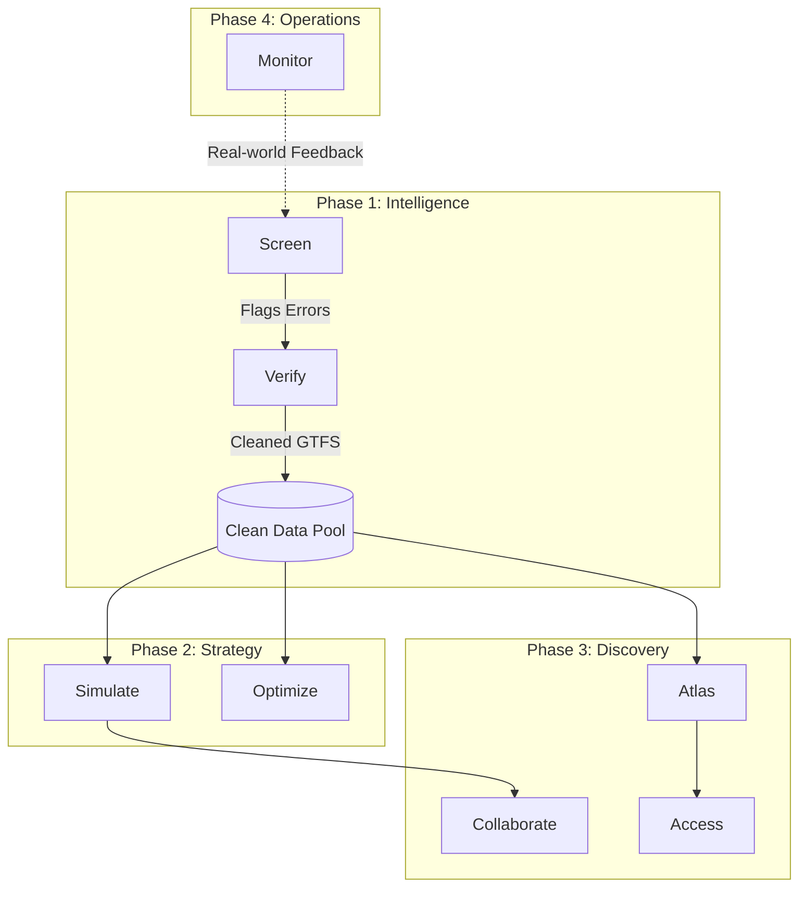

# Atlas: The Unified Transit Intelligence Ecosystem

Atlas is not just a collection of tools; it is a **closed-loop feedback system** for urban mobility. This document defines the role, justification, and relationship of every module.

---

## 🏗️ The Core Pipeline
The ecosystem is structured around three phases of the transit planning lifecycle:
1. **Intelligence (Cleaning & Integrity)**: Ensuring the data represents reality.
2. **Strategy (Modeling & Simulation)**: Testing changes in a safe environment.
3. **Discovery (Viewing & Public Engagement)**: Understanding the network and sharing it.

---

## 🛠️ Existing Tools

### 1. Screen
- **Definition**: Automated GTFS-static analysis and route tiering.
- **Justification**: Garbage in, garbage out. Planners often work with broken or messy GTFS data. Screen identifies these issues before they ruin a simulation.
- **Relationship**: Feeds **Verify** with detected anomalies.

### 2. Verify
- **Definition**: Human-in-the-loop validation interface.
- **Justification**: AI and scripts can identify *potential* errors, but transit is situational. Verify provides a "gameified" UI for planners to confirm or fix data discrepancies.
- **Relationship**: Finalizes the data that **Simulate** and **Atlas** rely on.

### 3. Simulate
- **Definition**: Stop consolidation and performance modeling.
- **Justification**: Modernizing a route (e.g., removing every other stop) is politically difficult. Simulate provides the hard data (travel time savings vs. walking distance) needed to defend a plan.
- **Relationship**: Takes cleaned data and generates "Future Scenarios" for **Collaborate**.

### 4. Atlas
- **Definition**: National longitudinal database viewer.
- **Justification**: Planners need context beyond their own city. Atlas provides high-level trends and comparisons across multiple agencies over time.
- **Relationship**: The "Google Earth" of transit, providing the base map for **Access**.

---

## 🚀 Future Roadmap

### 📍 1. Access (Equity & Accessibility)
- **Definition**: High-precision isochrone mapping, demographic equity analysis, and **Equity Monitoring**.
- **Justification**: Transit is a social service. We must answer: "Who can get to a doctor in 20 minutes?" and "Can they afford the trip?" This justifies funding based on both physical access and financial affordability.
- **Components**: 
    - **Transit Equity Monitor**: Comparative database of low-income discount programs across regions (Clipper START, LIFE, etc.).
    - **Accessibility Engine**: Isochrone generation based on GTFS and demographic overlays.
- **Relationship**: Built on top of **Atlas** data, adding demographic and policy layers.

### 🧬 2. Optimize (Network Redesign)
- **Definition**: Generative AI for route optimization.
- **Justification**: Manual route planning is slow and biased. Optimize uses algorithms to find the "mathematically perfect" grid before planners add human nuance.
- **Relationship**: An advanced engine that feeds ideas into **Simulate**.

### 🤝 3. Collaborate (Public Engagement)
- **Definition**: Public-facing scenario sharing and feedback portal.
- **Justification**: Plans fail at public hearings. Collaborate turns technical simulation results into simple, shareable links the public can understand and comment on.
- **Relationship**: Exports data from **Simulate** for public consumption.

### ⏱️ 4. Monitor (Real-time Operations)
- **Definition**: Dashboard for comparing real-time (GTFS-RT) performance to static plans.
- **Justification**: Planning is a theory; operations is the reality. Monitor closes the loop by showing if the consolidated stops in **Simulate** actually moved buses faster in real life.
- **Relationship**: Provides the "Ground Truth" feedback that restarts the **Screen** cycle.

---

## 📋 Proposed Next Steps

The following steps are prioritized by impact and dependency order.

### Priority 1 — Engineering Foundation

These are preconditions for sustainable development. They should be done before any major new features.

**1.1 Add a test framework**
- Install **Vitest** and **React Testing Library**
- Write unit tests for the two most critical pure-logic files first: `simulationEngine.ts` (travel time calculations) and `gtfsUtils.ts` (parsing and tiering logic)
- Target: cover the haversine function, frequency tier thresholds, and stop-removal mutations
- Prevents silent regressions as the Optimize and Access modules are added

**1.2 Set up GitHub Actions CI**
- Add a workflow that runs on every push and PR: `tsc --noEmit`, `vite build`, and the test suite
- Catches type errors and broken builds before they reach `main`

**1.3 Add ESLint**
- Install `eslint`, `@typescript-eslint/parser`, and `eslint-plugin-react-hooks`
- Enforce consistent imports, no-unused-vars, and hook dependency arrays
- Integrate into the CI workflow from 1.2

---

### Priority 2 — Complete Core Feature Set

**2.1 Implement the Optimize module**
- The module shell exists at `/src/modules/optimize/OptimizeView.tsx` but shows a placeholder
- Implement the two features described in the roadmap:
  - **AI-proposal engine**: Given a cleaned GTFS feed, score route overlaps and suggest consolidations (can start with a deterministic algorithm — longest overlapping segment detection — before adding any AI layer)
  - **Frequency balancing**: Propose headway adjustments to hit target tier thresholds with minimum resource change
- Wire the module to receive data from the `Clean Data Pool` (IndexedDB, same pattern as Simulate)

**2.2 Decouple agency-specific hardcoding**
- `ttcAlerts.ts` is wired exclusively to the Toronto Transit Commission's API
- Introduce an `AgencyConfig` type (agency name, GTFS-RT alerts URL, timezone) stored in IndexedDB alongside the uploaded GTFS
- The Simulator's live alert panel should read from this config instead of the hardcoded TTC endpoint
- This makes the tool usable by any agency, which is the stated national-database vision

**2.3 Add GTFS spec validation to Screen**
- The current screener parses GTFS and extracts metrics but does not validate compliance
- Add a validation pass that checks required files (`agency.txt`, `routes.txt`, `trips.txt`, `stop_times.txt`, `calendar.txt`) and required fields within each
- Surface validation errors in the Screen UI as a pre-analysis report before tiering runs
- Prevents misleading tier results from malformed feeds

---

### Priority 3 — Next Phase Features (from Roadmap)

**3.1 Access module (Equity & Isochrone Mapping)**
- Build on top of the existing Atlas Leaflet map
- Use the cleaned GTFS stop graph to compute walking-time isochrones (15, 30, 45-minute reach) from any selected origin stop
- Overlay census demographic data (can use a static GeoJSON for a target city) to surface equity gaps
- Key output: a "coverage score" per demographic zone, exportable to CSV

**3.2 Collaborate module (Scenario Sharing)**
- Export a Simulate session (baseline + modified stop list + performance delta) as a self-contained JSON blob
- Generate a shareable URL using a URL-safe base64 encoding of the blob (no backend required)
- A recipient loading the URL sees a read-only "scenario viewer" — the same map and metrics panels from Simulate but non-editable
- This directly addresses the roadmap goal of turning technical results into public-facing materials

---

### Priority 4 — Operational Readiness

**4.1 Configure deployment**
- Add a `vite.config.ts` `base` option and a GitHub Pages or Netlify deploy step to the CI workflow
- The app is already entirely client-side, so deployment is trivial once CI is in place

**4.2 Monitor module (GTFS-RT Integration)**
- Consume a GTFS-RT `VehiclePositions` or `TripUpdates` feed (using the agency config from 2.2)
- Compare real-time headways to the static schedule tiers computed by Screen
- Display a live "plan vs. reality" dashboard that feeds anomalies back into the Screen queue
- This closes the feedback loop described in the core pipeline diagram
