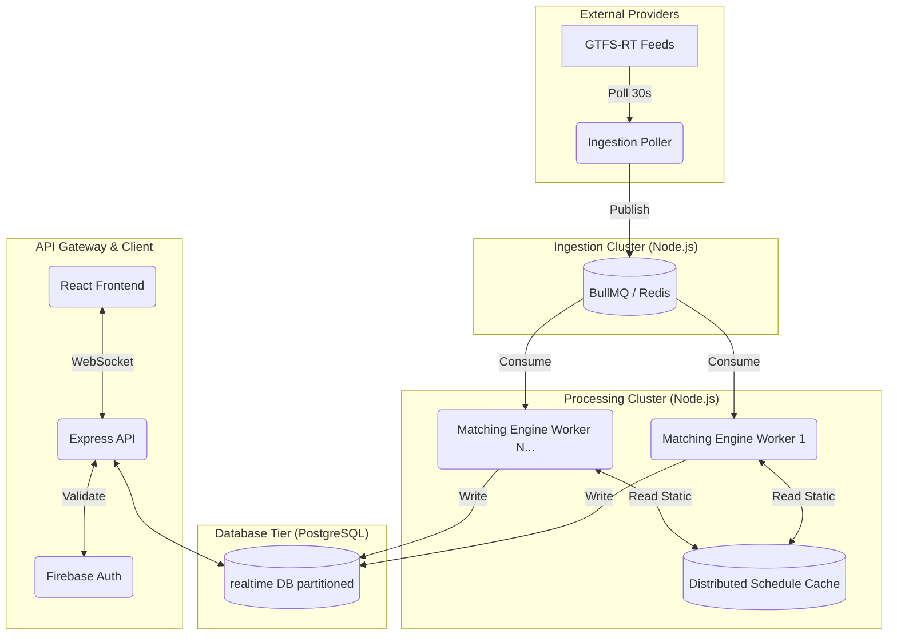

# Atlas NextGen: Phase 3 Architecture Proposal

As we look beyond the initial "Big Fish" (MTA) validation, the system must evolve from a monolithic Node.js processor into a scalable, enterprise-grade data pipeline capable of handling nationwide transit telemetry. This document outlines a comprehensive, phased approach to maturing the **Phase 2 Intelligence Layer** across four primary pillars: Scalability, Security, Data Integrity, and Advanced Analytics.

---

## 🏗️ System Architecture Vision

---

## Phase 3.1: Security Hardening & API Protection (Quick Wins)
*The immediate goal is to secure the diagnostic endpoints and harden the infrastructure against abuse or accidental mutation, capitalizing on low-effort/high-impact components.*

### 1. JWT Authentication Guarding
**The Problem**: Diagnostic endpoints like `/api/corridors/performance` and `/api/intelligence/matching-stats` are currently open. If exposed to the internet, they are vulnerable to arbitrary queries.
**The Implementation**: 
- We already use Firebase Authentication on the React frontend.
- Implement Express middleware using `firebase-admin` to decode and verify the incoming JWT `Authorization: Bearer <token>` header.
- Create strict RBAC (Role-Based Access Control) to allow only specific user UUIDs to access admin-level diagnostics.

### 2. Query Rate Limiting & Complexity Bounds
**The Problem**: A malicious or looping client script could continuously request massive aggregations spanning weeks of data, locking up the PostgreSQL CPU and dropping live ingestion packets.
**The Implementation**:
- Add `express-rate-limit` to all public API routes (e.g., 60 requests per minute per IP).
- Implement strict payload validation using `Zod`. For example, enforce a maximum `windowWidth` of 24 hours on all analytical `/performance` queries. Requests asking for larger windows should receive a `400 Bad Request`.

### 3. Principle of Least Privilege (Database Roles)
**The Problem**: The backend currently connects to PostgreSQL using a single superuser or database-owner credential. A vulnerability in the API could allow an attacker to `DROP TABLE` or mutate historical data.
**The Implementation**:
- Segregate the connection pools:
  - **Ingestion Pipeline**: Connects via an `atlas_writer` role possessing strictly `INSERT` capabilities on `vehicle_positions`.
  - **Express API**: Connects via an `atlas_reader` role possessing strictly `SELECT` capabilities across both `static` and `realtime` databases.

### 4. Secret Management & Rotation
**The Problem**: Production API keys (like `MTA_BUS_API_KEY`) are stored in raw `.env` files.
**The Implementation**:
- Integrate a dedicated Secret Manager (e.g., AWS Secrets Manager, Google Cloud Secret Manager, or HashiCorp Vault).
- Inject secrets at runtime via a bootstrap script, ensuring keys never touch the local filesystem in production deployments.

---

## Phase 3.2: Scalability & Reliability Migration
*The intermediate goal is to decouple the ingestion pipeline from the spatial matching engine, allowing horizontal scaling past 10,000+ concurrent vehicles.*

### 1. Message Queuing (Decoupling Ingestion & Math)
**The Problem**: The system operates synchronously. Fetching 8,000 MTA records, performing Haversine math on thousands of static stops, and executing batch inserts all happens sequentially in Node.js. A slow database write delays the next 30-second polling cycle.
**The Implementation**:
- Introduce an asynchronous message queue using **BullMQ** (backed by Redis).
- The Poller becomes a highly isolated chron-job that strictly fetches GTFS-RT Protobufs and dumps raw JSON payloads onto the queue.
- Expand the application into a "Cluster" where multiple independent Worker processes consume from the queue, perform the heavy spatial geometry limits, and seamlessly batch-insert into Postgres.

### 2. Distributed Memory Caching (Redis)
**The Problem**: The `scheduleCache` holds GTFS shape mappings and stop sequences in local V8 memory. If we scale up to 4 worker nodes, this cache is duplicated 4 times, risking local memory exhaustion (OOM).
**The Implementation**:
- Migrate the `Map<string, TripDetail>` schedule cache from local Node.js memory into a centralized **Redis** cluster. 
- Leverage Redis Hashes (`HGET`, `HSET`) to look up static scheduled trips rapidly across multiple stateless API/Worker pods.

### 3. PostgreSQL Table Partitioning
**The Problem**: The `vehicle_positions` table acts as our historical ledger and will expand by roughly 5-10 million rows per day when processing 18 agencies. Standard B-Tree indices will eventually degrade, causing `matching-stats` to time out.
**The Implementation**:
- Implement Native PostgreSQL Declarative Partitioning utilizing the `pg_partman` extension.
- Partition `vehicle_positions` by `agency_id` **and** time (e.g., daily or weekly chunks automatically generated).
- This ensures that 5-minute diagnostic lookbacks execute in $O(1)$ time by skipping historical partitions entirely.

---

## Phase 3.3: Advanced Analytics & UX Expansion
*The final phase focuses on delivering higher-fidelity intelligence to planners, shifting from descriptive tracking to predictive telemetry.*

### 1. Ghost Vehicle & Anomaly Detection Algorithm
**The Problem**: Bad GPS drift or malfunctioning transponders often report vehicles miles away from their actual physical route, artificially punishing headway reliability scores.
**The Implementation**:
- Introduce a rolling spatial validator. Calculate physical speed between consecutive `obs_at` pings; if speed exceeds realistic physical limits (e.g., >80mph down a local street), drop the ping.
- Perform a 500-meter bounding box exclusion. If a vehicle's coordinates do not intersect its scheduled `shape_id` polyline, classify it as "Ghost / Off-Route" and suspend its headway calculation impact.

### 2. Predictive Headway Modeling
**The Problem**: Currently, we measure "actual gap" versus "scheduled gap" purely on current coordinates.
**The Implementation**:
- Introduce a specialized forecasting engine inside `headway.ts`.
- Instead of just calculating "what is the delay", use historical archive data to generate a "90th Percentile Arrival" bracket. By determining structural choke points (e.g., bridges at 4 PM), we can predict downstream delays before the bus reaches the actual congestion zone.

### 3. Occupancy & Load Telemetry
**The Problem**: Route health isn't just about punctuality; it's about capacity.
**The Implementation**:
- Integrate GTFS-RT `occupancy_status` (supported by tier-1 agencies like MBTA/TTC).
- Map enums (`MANY_SEATS_AVAILABLE`, `STANDING_ROOM_ONLY`, `CRUSHED_LOAD`) to numeric weights.
- Incorporate load weights into the `CorridorMonitor.tsx` frontend so planners can immediately identify if a "bunched" bus is actually empty while the follower is crushed.

### 4. WebSockets (Socket.io) For Real-Time UI
**The Problem**: The React `Live Map` uses short-pooling (`setInterval` fetch every 30s) against `/api/vehicles`. This generates massive network payloads re-downloading thousands of identical coordinates.
**The Implementation**:
- Refactor the API to use Server-Sent Events (SSE) or WebSockets.
- The backend will push a binary delta-patch solely containing vehicles that have changed coordinates. 
- Reduces rendering jank and cuts outbound Cloud/Egress payload bandwidth by ~90%.
